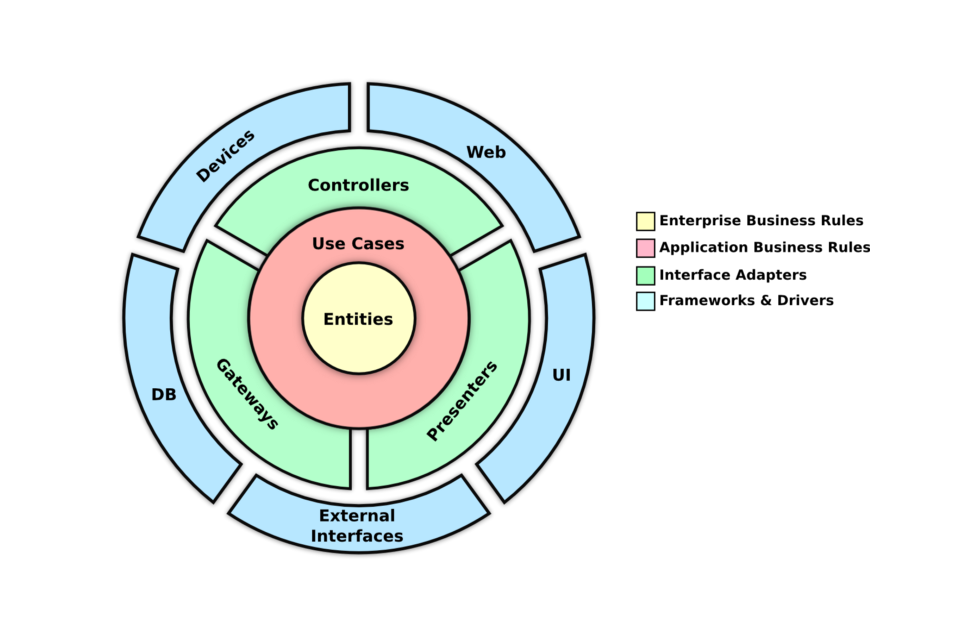

# Clean Architecture

Clean Architecture is a software design paradigm that emphasizes separation of concerns and maintainability by structuring systems into layers where each layer serves a specific purpose and is independent of implementation details. At its core, Clean Architecture advocates for decoupling business logic from frameworks, databases, and other external dependencies, promoting testability, flexibility, and scalability. The architecture typically consists of concentric layers, with the innermost layer containing entities representing business objects and use cases, surrounded by layers for interfaces, application logic, and external frameworks or drivers. This approach encourages a clear separation of concerns, making it easier to understand, modify, and extend software systems over time.

## Architectural Limits

Clean Architecture defines architectural boundaries that separate the core business logic from external concerns such as frameworks, databases, and user interfaces. These boundaries establish clear distinctions between different layers of the system, ensuring that each layer has a specific responsibility and is decoupled from implementation details. By enforcing architectural limits, Clean Architecture promotes modularity, testability, and maintainability, making it easier to evolve and extend software systems over time.

## Inputs and Outputs

Clean Architecture distinguishes between inputs and outputs to define the flow of data and interactions within the system. Inputs represent requests or commands that trigger specific actions or operations, while outputs represent responses or results that are returned to the user or external systems. By separating inputs and outputs, Clean Architecture ensures that business logic remains independent of external concerns and can be easily tested and modified without affecting the rest of the system.

An API request, for example, can be considered as an input that must traverse through the innermost layer of the system, where the business logic is situated. It passes through each layer of the system before the response, as an output, travels back through all the layers in the opposite direction.

**Request:** Web -> Controller -> Use Case -> Entity

**Response:** Entity -> Use Case -> Controller -> Web

## Use Cases

Use Cases are a fundamental component of Clean Architecture, they represent distinct functionalities or features that the system provides to its users. Use Cases encapsulate the business logic of the application, defining how users interact with the system to achieve specific goals or perform actions. In other words they represent the intent of the user and the corresponding response from the system.

### Characteristics of Use Cases in Clean Architecture:

- **Independence:** Each use case is independent of the infrastructure, frameworks, and external dependencies. This ensures that the business logic remains isolated and easily testable without being tightly coupled to implementation details. _Keep options open_.

- **Single Responsibility:** Use Cases adhere to the Single Responsibility Principle (SRP), focusing on a specific task or functionality within the system. This granularity facilitates easier maintenance, testing, and modifications.

- **Input and Output:** Use Cases define clear inputs (requests or commands) and outputs (responses or results) that enable communication with the external layers. This separation ensures that use cases remain agnostic of the presentation or data access mechanisms.

- **Encapsulation of Business Rules:** Business rules and domain logic are encapsulated within the use cases, ensuring that they are centrally managed and consistent across the application. This promotes a clear separation of concerns and enhances the maintainability of the system.
